# 一、iOS证书配置

* 1. iOS证书配置网址
  ```
  https://developer.apple.com/account/
  ```

* 2. 添加包名
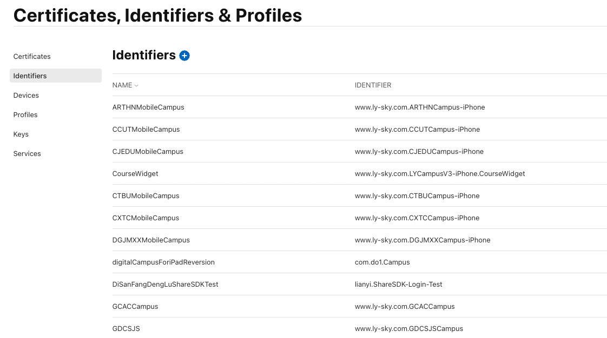
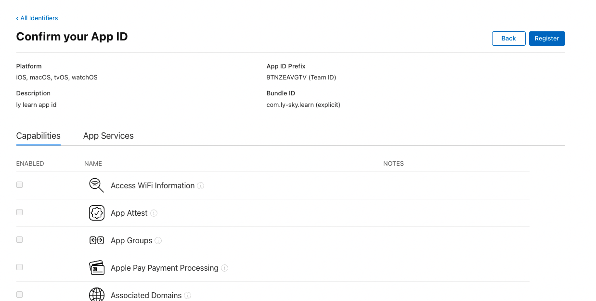

* 3. 制作证书
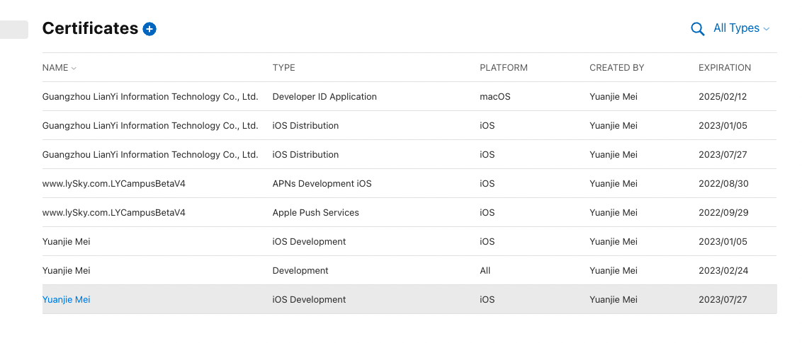
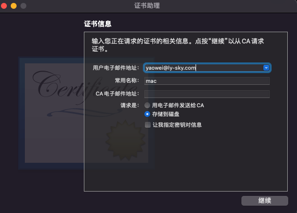
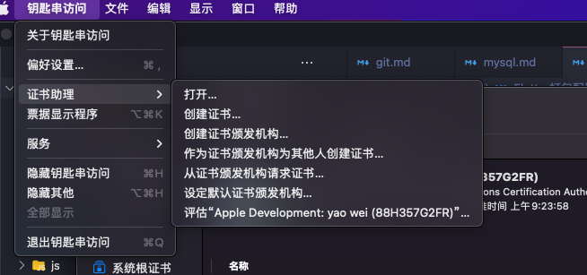
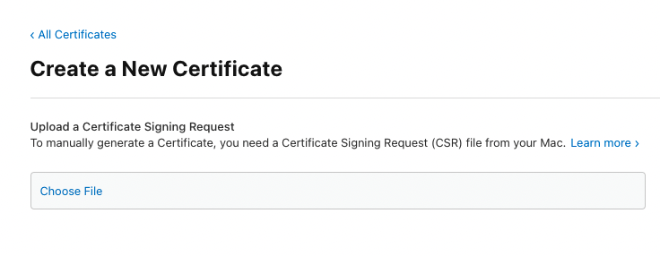
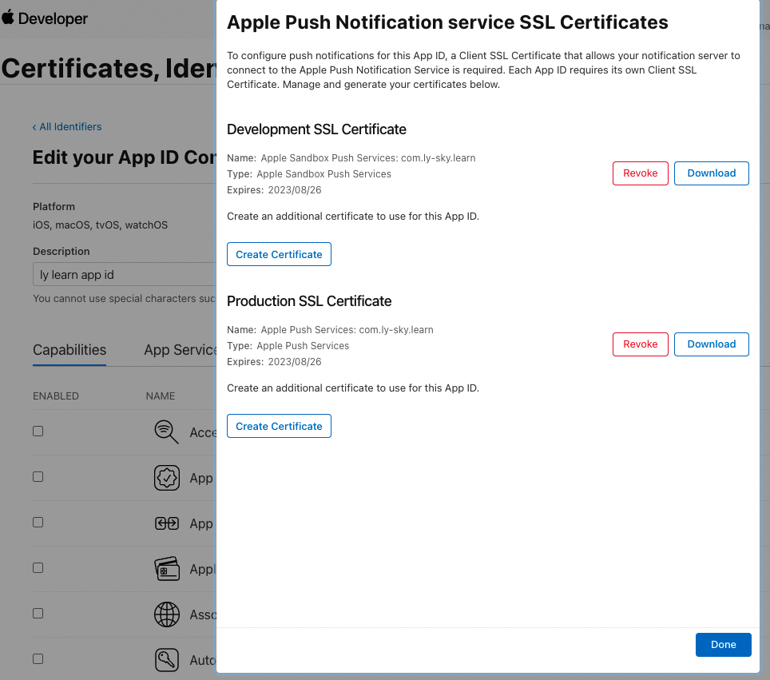

* 3. 制作描述文件
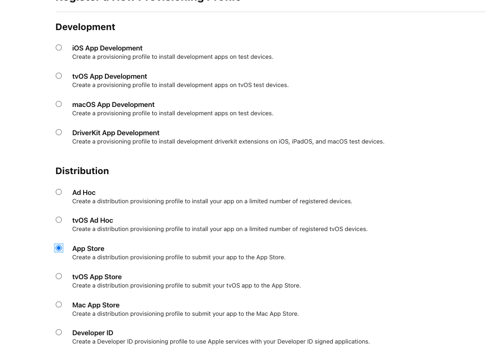
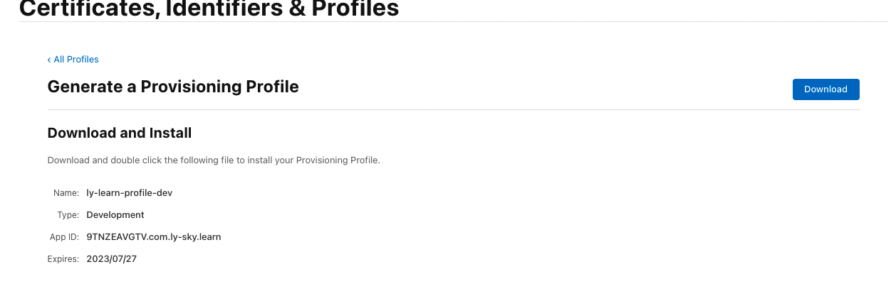
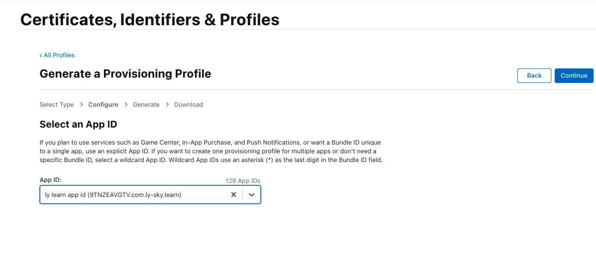
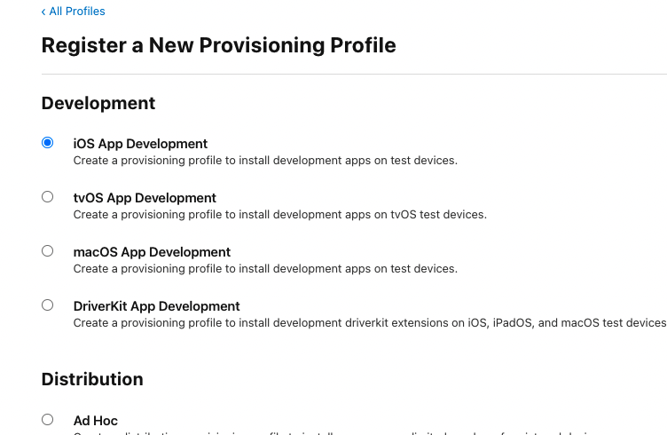

# 二、本地真机调试(常见错误)
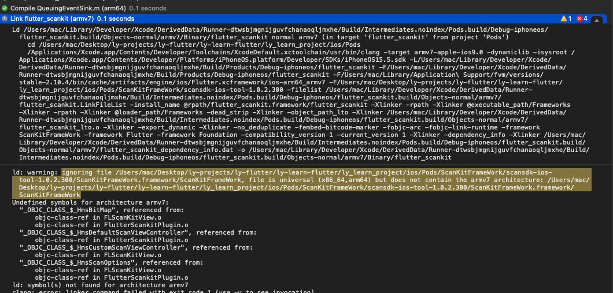
* 华为二维码扫描库仅支持Arm64架构，Xcode默认支持Arm64和ArmV7，所以在Xcode中移除V7架构
  
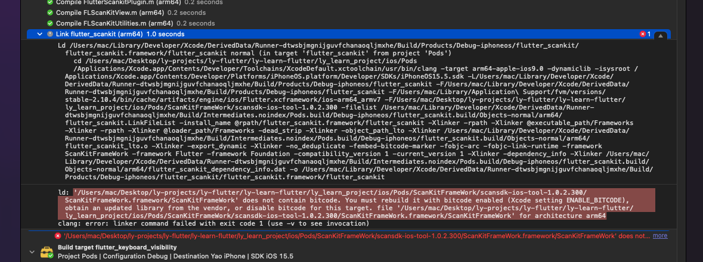
* 华为二维码扫描库不支持Bitcode,在Podfile文件中关闭bitcode

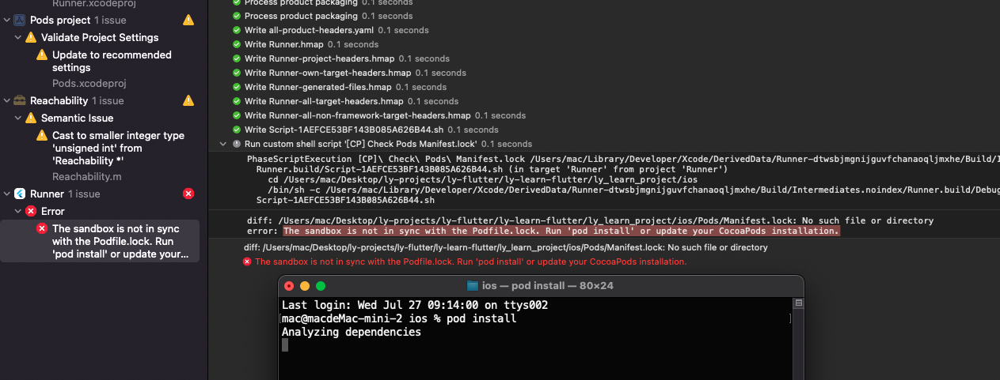
* 第一次运行需要安装依赖(pod install)

# 三、配置启动图和AppIcon
* 启动图配置
  
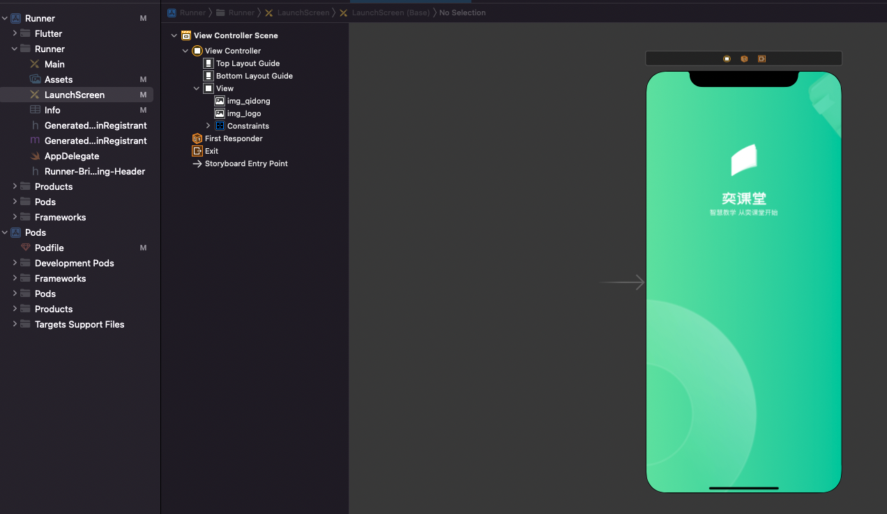

* Info.plist配置
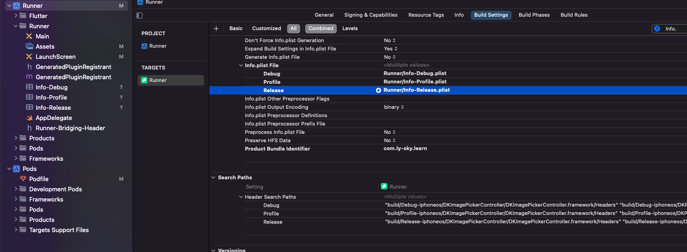

# 二、iOS/Andorid多环境打包
```
#!/bin/sh
#环境
environments=(dev test prod)
#平台
platforms=(android ios)
#工程路径
project_path=$(pwd)
#导出路径
export_path=${project_path}/export
#apk导出路径
apk_export_path=${export_path}/apk
#ipa导出路径
ipa_export_path=${export_path}/ipa
#ipa构建路径
ipa_build_path=${export_path}/ipa_build
#ipa构建导出路径
ipa_build_export_path=${ipa_build_path}/ipa
#apk正式包路径
apk_release_path=${project_path}/build/app/outputs/apk/release

ipa_export_plist_path=${project_path}/ios/ExportOptions.plist
ipa_app_name="ly_learn_project"
ipa_project_name=Runner
ipa_scheme_name=Runner
ipa_development_mode=Release


pgyer_apiKey=25142a06ea4197b19e9860cadef6f708
pgyer_userKey=b8a0abc7ea7fb882859221b1a7299706


#-------------------- build apk ----------------------
build_apk() {
if [ $env_number == 0 ]; then
    echo "=============== 开始构建：全部环境包 ==============="
    for(( i=0;i<${env_length};i++ )) do
        build_apk_by_env "${environments[$i]}"
    done;
else
    build_apk_by_env "${environments[$((env_number-1))]}"
fi
}

build_apk_by_env()
{
current_env=$1
echo "正在构建 apk：$current_env 环境包"
flutter build apk --dart-define=APP_ENV="$current_env"
dest_apk=${apk_export_path}/app-release-${current_env}.apk
cp -f ${apk_release_path}/app-release.apk $dest_apk
echo "导出 apk: $dest_apk"

echo "开始上传:$dest_apk"
result=$(curl -F "file=@${dest_apk}" -F "uKey=${pgyer_userKey}" -F "_api_key=${pgyer_apiKey}" https://www.pgyer.com/apiv1/app/upload)
echo "apk上传结果: $result"
}

#-------------------- build ipa ----------------------
build_ipa()
{
  if [ $env_number == 0 ]; then
    echo "=============== 开始构建：全部环境包 ==============="
    for(( i=0;i<${env_length};i++)) do
      echo "正在构建ipa：${environments[$i]} 环境包"
      flutter build ios --release --dart-define=APP_ENV="${environments[$i]}"
      build_ipa_by_env "${environments[$i]}"
    done;
else
    echo "正在构建ipa：${environments[$((env_number-1))]} 环境包"
    flutter build ios --release --dart-define=APP_ENV="${environments[$((env_number-1))]}"
    build_ipa_by_env ${environments[$((env_number-1))]}
fi
}

build_ipa_by_env() {
current_env=$1
xcodebuild \
archive -workspace ${project_path}/ios/${ipa_project_name}.xcworkspace \
-scheme ${ipa_scheme_name} \
-configuration ${ipa_development_mode} \
-archivePath ${ipa_build_path}/${ipa_project_name}.xcarchive  -quiet  || exit

echo ''
echo '=============== 开始IPA打包 ==============='
xcodebuild -exportArchive -archivePath ${ipa_build_path}/${ipa_project_name}.xcarchive \
-configuration ${ipa_development_mode} \
-exportPath ${ipa_build_export_path} \
-exportOptionsPlist ${ipa_export_plist_path} \
-quiet || exit

if [ -e $ipa_build_export_path/$ipa_app_name.ipa ]; then
dest_ipa=$ipa_export_path/$ipa_app_name-$current_env.ipa
cp -f $ipa_build_export_path/$ipa_app_name.ipa $dest_ipa
echo "=============== IPA包已导出:$dest_ipa ==============="
echo "=============== 开始上传:ipa ==============="
result=$(curl -F "file=@${dest_ipa}" -F "uKey=${pgyer_userKey}" -F "_api_key=${pgyer_apiKey}" https://www.pgyer.com/apiv1/app/upload)
echo "=============== APK包上传结果:$result ==============="
else
echo '=============== IPA包导出失败 ==============='
exit 1
fi
}

#-------------------- 清除缓存 ----------------------
clean_tips="执行flutter clean(默认:n) [ y/n ]"
echo $clean_tips
read  -t 10 is_clean
if [ ! -n "${is_clean}" ];then
	is_clean="n"
fi

while([[ $is_clean != "y" ]] && [[ $is_clean != "n" ]])
do
  echo "错误! 只能输入[ y/n ] ！！！"
  echo $clean_tips
  read is_clean
done

#-------------------- 选择打包平台 ----------------------
platforms_tips="请输入需要打包的平台(默认：0) [ ALL: 0, "
platforms_length=${#platforms[@]};
for((i=0; i<$platforms_length; i++)) do
  if (($i < $platforms_length-1)); then
    platforms_tips="${platforms_tips}${platforms[i]}: $((i+1)), "
  else
    platforms_tips="${platforms_tips}${platforms[i]}: $((i+1)) ]"
  fi
done

echo "$platforms_tips"
read -t 10 platforms_number
if [ ! -n "${platforms_number}" ];then
	platforms_number=0
fi

while(( $platforms_number < "0" || $platforms_number > $platforms_length ))
do
  echo "错误!只能输入0到${platforms_length} ！！！"
  echo $platforms_tips
  read platforms_number
done

#-------------------- 选择打包环境 ----------------------
env_tips="请输入选择应用环境(默认：0) [ ALL: 0, "
env_length=${#environments[@]};
for((i=0; i<$env_length; i++)) do
  if (($i < $env_length-1)); then
    env_tips="${env_tips}${environments[i]}: $((i+1)), "
  else
    env_tips="${env_tips}${environments[i]}: $((i+1)) ]"
  fi
done

echo "$env_tips"
read -t 10 env_number
if [ ! -n "${env_number}" ];then
	env_number=0
fi

while(( $env_number < "0" || $env_number > $env_length ))
do
  echo "错误!只能输入0到${env_length} ！！！"
  echo $env_tips
  read env_number
done

echo "platforms_number: ${platforms_number}, env_number: ${env_number}, is_clean: ${is_clean}"

if [ -d "${export_path}" ]; then
  rm -rf "${export_path}"
fi

mkdir -p "${ipa_export_path}"
mkdir -p "${apk_export_path}"
mkdir -p "${ipa_build_export_path}"

if [ ${is_clean} = "y" ];then
  echo "=============== 开始清理 ==============="
  flutter clean
fi


if [ $platforms_number == 0 ];then
    build_apk
    echo "=============== APK 构建完毕，开始构建IAP ==============="
    build_ipa
elif [ $platforms_number == 1 ]; then
    build_apk
elif [ $platforms_number == 2 ]; then
    build_ipa
fi

```

* 取消Xcode自增版本号
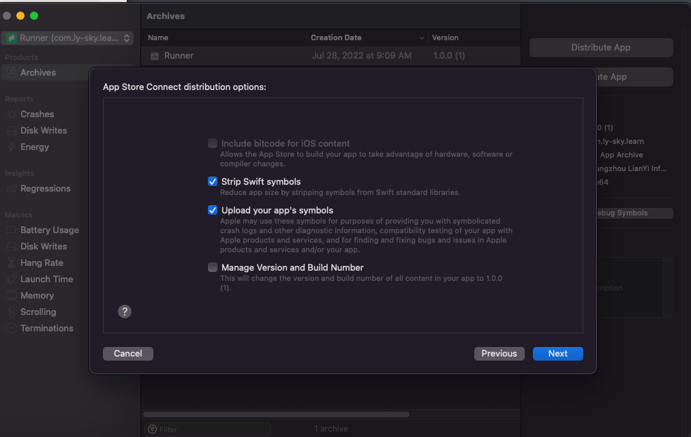

* iOS 增加 PRE ACTION  
```
function entry_decode() { echo "${*}" | base64 --decode; }
IFS=',' read -r -a define_items <<< "$DART_DEFINES"

target_index=1;

for index in "${!define_items[@]}"
do
    define_items[$index]=$(entry_decode "${define_items[$index]}");

    if [[ "${define_items[$index]}"  =~ "APP_ENV" ]]; then
        target_index=$index;        
    fi
done

result=${define_items[$target_index]}

OLD_IFS="$IFS"
IFS="="
array=($result)
IFS="$OLD_IFS"

env=${array[1]}

app_name='Runner'
if [ $env == "dev" ]; then
    app_name='奕课堂-dev'
elif [ $env == "test" ]; then
    app_name='奕课堂-test'
elif [ $env == "prod" ]; then
    app_name='奕课堂'
fi

outs=("APP_ENV=$env" "APP_NAME=$app_name")
printf "%s\n" "${outs[@]}" > ${SRCROOT}/Flutter/DartDefineConfigs.xcconfig
```

* Andorid
```
//获取渠道参数使用,设置默认参数
def dartEnvVariables = [APP_ENV: 'dev',]
//设置默认名称
def appName = '奕管'
if (project.hasProperty('dart-defines')) {
    dartEnvVariables = dartEnvVariables + project.property('dart-defines')
            .split(',')
            .collectEntries { entry ->
                def pair = new String(entry.decodeBase64(), 'UTF-8').split('=')
                [(pair.first()): pair.last()]
            }
}

if (dartEnvVariables.APP_ENV != 'public') {
    appName += "-${dartEnvVariables.APP_ENV}"
}
```

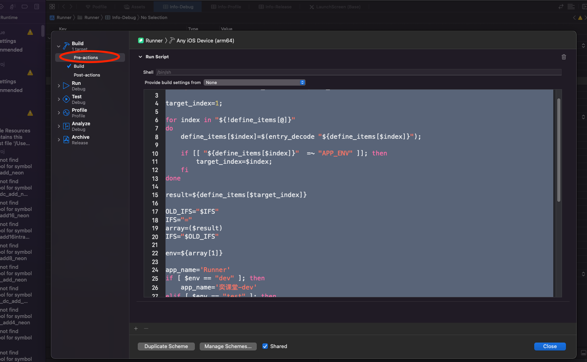
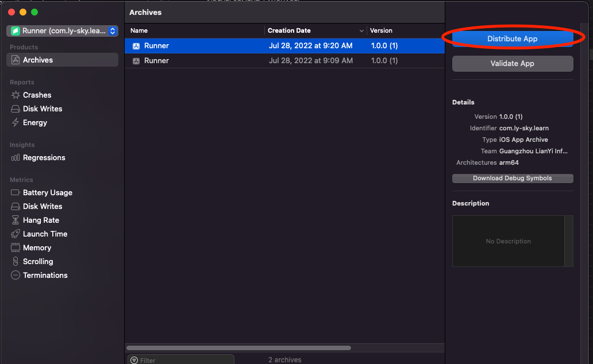