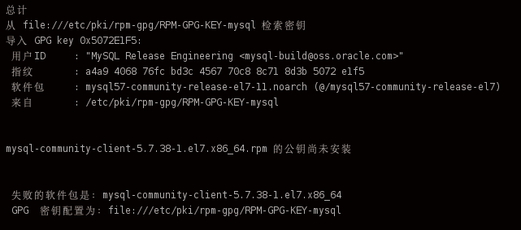

安装环境： CentOS 7.2 64位

## 一、下载rpm
https://repo.mysql.com/ 中找到自己要下载的版本，这里以5.7为例

`wget https://repo.mysql.com/mysql57-community-release-el7.rpm`


## 二、安装mysql源
```
yum -y install mysql57-community-release-el7.rpm
yum -y install mysql-community-server
```


如果碰到公钥问题


```
rpm --import https://repo.mysql.com/RPM-GPG-KEY-mysql-2022
yum -y install mysql-community-server
```

## 三、启动mysql

```
systemctl start  mysqld.service
systemctl status mysqld.service
```

## 四、查看mysql的root密码
```
grep "password" /var/log/mysqld.log
```

## 五、登录到mysql

```
mysql -uroot -p
```

## 六、修改root密码
默认root密码不能过于简单，否则会出现ERROR，需要设置两个参数使其可以设置简单密码

```
mysql> alter user 'root'@'localhost' identified by 'root';
ERROR 1819 (HY000): Your password does not satisfy the current policy requiremen 
mysql> set global validate_password_policy=0;
mysql> set global validate_password_length=1;
mysql> alter user 'root'@'localhost' identified by 'root';
```

设置root 允许外面连接
```
grant all privileges on *.* to root@'%' identified by '123456' with grant option;
flush privileges;
```

修改数据库访问权限说明
```
# 第一种：所有的ip都有资格访问该数据库
GRANT ALL PRIVILEGES ON *.* TO 'root'@'%' IDENTIFIED BY 'password' WITH GRANT OPTION;

# 第二种：为指定的ip开放访问权限
GRANT ALL PRIVILEGES ON *.* TO 'root'@'192.168.12.1' IDENTIFIED BY ‘password' WITH GRANT OPTION;

```

修改完权限之后，重启服务
```
systemctl restart mysqld.service
```

## 七、删除yum源

```
yum -y remove mysql57-community-release.noarch
```

## 八、设置开机启动

```
[root@mysql01 tools]# systemctl enable mysqld
[root@mysql01 tools]# systemctl daemon-reload
```


## 九、创建用户及数据库
```
mysql> set global validate_password_policy=0;
mysql> set global validate_password_length=1;
mysql> create user 'kfbb'@'%' identified by 'kfbb';
mysql> create database kfbb;
#给kfbb用户授权kfbb库的所有权限
mysql> grant all privileges on kfbb.* to kfbb@localhost identified by 'kfbb';
```


## 十、远程访问
```
mysql> grant all privileges on kfbb.* to 'kfbb'@'%' identified by 'kfbb' with grant option;
mysql> flush privileges;
mysql> use mysql
mysql> select host,user from user;
+-----------+---------------+
| host      | user          |
+-----------+---------------+
| %         | kfbb          |
| localhost | kfbb          |
| localhost | mysql.session |
| localhost | mysql.sys     |
| localhost | root          |
+-----------+---------------+
5 rows in set (0.00 sec)

```
